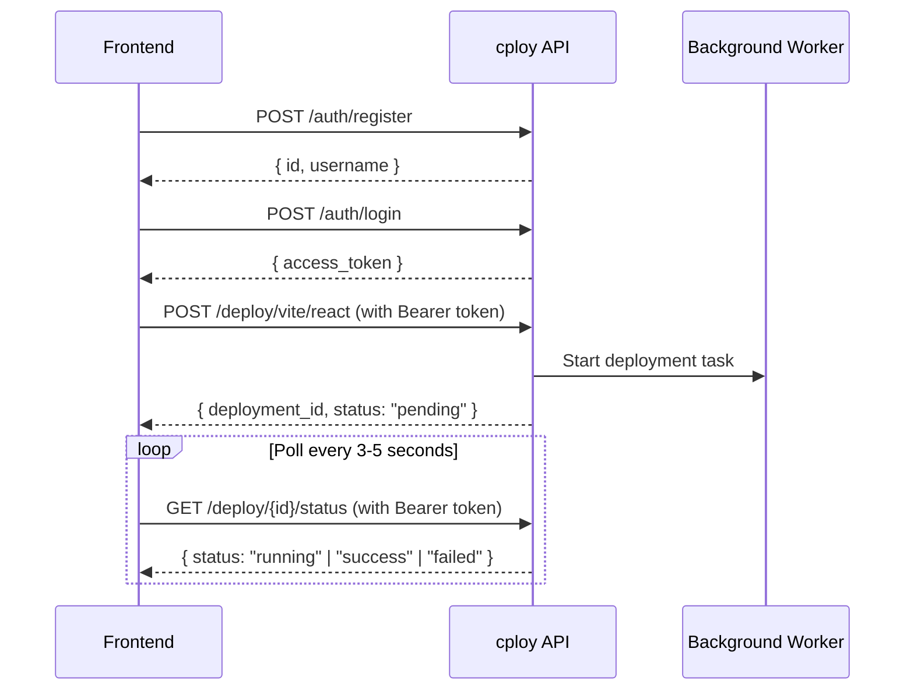
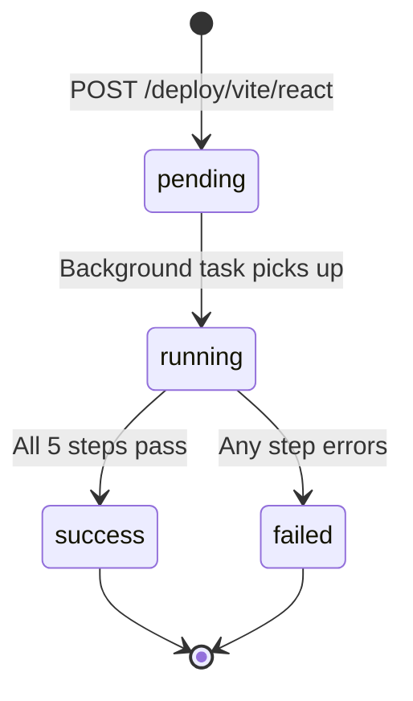

# cploy API Documentation

> **Base URL**: `http://<server-ip>:8000`
> **Interactive Docs**: `GET /docs` (Swagger UI) · `GET /redoc` (ReDoc)

---

## Table of Contents

- [Overview](#overview)
- [Authentication](#authentication)
  - [How Auth Works](#how-auth-works)
  - [POST /auth/register](#post-authregister)
  - [POST /auth/login](#post-authlogin)
- [Deploy](#deploy)
  - [How Deploy Works](#how-deploy-works)
  - [POST /deploy/vite/react](#post-deployvitereact)
  - [GET /deploy/{deployment_id}/status](#get-deploydeployment_idstatus)
- [Health Check](#health-check)
  - [GET /](#get-)
- [Data Models Reference](#data-models-reference)
- [Deployment Status Lifecycle](#deployment-status-lifecycle)
- [Error Reference](#error-reference)
- [Frontend Integration Guide](#frontend-integration-guide)

---

## Overview

cploy is a self-hosted deployment platform. The API lets you:

1. **Register** an account and **log in** to receive a JWT
2. **Deploy** a Vite + React app from a GitHub repo (runs asynchronously in the background)
3. **Poll** the deployment status until it completes

All deploy endpoints are **protected** — they require a valid JWT in the `Authorization` header.



---

## Authentication

### How Auth Works

| Detail | Value |
|--------|-------|
| **Method** | JWT Bearer Token (OAuth2 Password Flow) |
| **Token Lifetime** | 60 minutes |
| **Algorithm** | HS256 |
| **Header Format** | `Authorization: Bearer <token>` |

> [!IMPORTANT]
> Store the `access_token` securely on the client (e.g. in memory or `httpOnly` cookie). Include it in the `Authorization` header for all protected endpoints.

---

### POST /auth/register

Create a new user account.

| Property | Value |
|----------|-------|
| **URL** | `/auth/register` |
| **Method** | `POST` |
| **Auth Required** | ❌ No |
| **Content-Type** | `application/json` |

#### Request Body

| Field | Type | Required | Description |
|-------|------|----------|-------------|
| `username` | `string` | ✅ | Unique username (max 50 characters) |
| `password` | `string` | ✅ | Plain-text password (hashed server-side with bcrypt) |

```json
{
  "username": "john",
  "password": "securePassword123"
}
```

#### Success Response — `201 Created`

| Field | Type | Description |
|-------|------|-------------|
| `id` | `integer` | The newly created user's ID |
| `username` | `string` | The registered username |

```json
{
  "id": 1,
  "username": "john"
}
```

#### Error Responses

| Status | Condition | Response Body |
|--------|-----------|---------------|
| `400 Bad Request` | Username already taken | `{"detail": "Username already taken"}` |
| `422 Unprocessable Entity` | Missing/invalid fields | Validation error details |

#### Frontend Example

```javascript
const response = await fetch("/auth/register", {
  method: "POST",
  headers: { "Content-Type": "application/json" },
  body: JSON.stringify({
    username: "john",
    password: "securePassword123",
  }),
});

if (response.status === 201) {
  const user = await response.json();
  console.log("Registered:", user.username);
} else if (response.status === 400) {
  const error = await response.json();
  alert(error.detail); // "Username already taken"
}
```

---

### POST /auth/login

Authenticate with username and password. Returns a JWT access token.

| Property | Value |
|----------|-------|
| **URL** | `/auth/login` |
| **Method** | `POST` |
| **Auth Required** | ❌ No |
| **Content-Type** | `application/x-www-form-urlencoded` |

> [!WARNING]
> This endpoint uses **form data** (`application/x-www-form-urlencoded`), **not** JSON. This follows the OAuth2 password flow standard.

#### Request Body (Form Fields)

| Field | Type | Required | Description |
|-------|------|----------|-------------|
| `username` | `string` | ✅ | Registered username |
| `password` | `string` | ✅ | User's password |

```
username=john&password=securePassword123
```

#### Success Response — `200 OK`

| Field | Type | Description |
|-------|------|-------------|
| `access_token` | `string` | JWT token to use in `Authorization` header |
| `token_type` | `string` | Always `"bearer"` |

```json
{
  "access_token": "eyJhbGciOiJIUzI1NiIsInR5cCI6IkpXVCJ9.eyJzdWIiOiJqb2huIiwiZXhwIjoxNjk...",
  "token_type": "bearer"
}
```

#### Error Responses

| Status | Condition | Response Body |
|--------|-----------|---------------|
| `401 Unauthorized` | Wrong username or password | `{"detail": "Invalid username or password"}` |
| `422 Unprocessable Entity` | Missing fields | Validation error details |

#### Frontend Example

```javascript
const response = await fetch("/auth/login", {
  method: "POST",
  headers: { "Content-Type": "application/x-www-form-urlencoded" },
  body: new URLSearchParams({
    username: "john",
    password: "securePassword123",
  }),
});

if (response.ok) {
  const data = await response.json();
  // Store token for subsequent requests
  localStorage.setItem("token", data.access_token);
} else {
  const error = await response.json();
  alert(error.detail); // "Invalid username or password"
}
```

---

## Deploy

### How Deploy Works

Deployments are **asynchronous**. When you start a deploy:

1. The API creates a deployment record and returns immediately with `202 Accepted`
2. The actual build + deploy runs in a background task on the server
3. The frontend **polls** the status endpoint to track progress

The deployment pipeline runs these steps sequentially:
1. Create deployment directory on the server
2. Generate `docker-compose.yml`
3. Clone the GitHub repository
4. Run `docker-compose up -d --build`
5. Configure nginx reverse proxy

If any step fails, the deployment is marked `failed` with the error details.

> [!TIP]
> Multiple deployments can run concurrently. Each runs in its own background task, so users don't have to wait for each other.

---

### POST /deploy/vite/react

Start a new Vite + React deployment. The request returns immediately while the deployment runs in the background.

| Property | Value |
|----------|-------|
| **URL** | `/deploy/vite/react` |
| **Method** | `POST` |
| **Auth Required** | ✅ Yes — `Authorization: Bearer <token>` |
| **Content-Type** | `application/json` |

#### Request Headers

| Header | Value | Required |
|--------|-------|----------|
| `Authorization` | `Bearer <access_token>` | ✅ |
| `Content-Type` | `application/json` | ✅ |

#### Request Body

| Field | Type | Required | Description |
|-------|------|----------|-------------|
| `image_name` | `string` | ✅ | Name for the Docker image and container. Also becomes the subdomain: `<image_name>.dev-saurabh-k.xyz` |
| `port` | `string` | ✅ | Host port to map to the container's port 80 (e.g. `"10005"`) |
| `repo_url` | `string` | ✅ | GitHub repository URL to clone (e.g. `"https://github.com/user/repo.git"`) |

```json
{
  "image_name": "myapp",
  "port": "10005",
  "repo_url": "https://github.com/johndoe/my-react-app.git"
}
```

> [!IMPORTANT]
> - `image_name` must be **unique** across all deployments (it's used as the Docker container name and nginx subdomain)
> - `port` must be **unique** and not in use by another deployment or service
> - `repo_url` must contain a valid Vite + React project with a `package.json` at the root

#### Success Response — `202 Accepted`

| Field | Type | Description |
|-------|------|-------------|
| `deployment_id` | `integer` | Unique ID to poll for status |
| `status` | `string` | Always `"pending"` at this point |
| `message` | `string` | Human-readable instructions |

```json
{
  "deployment_id": 1,
  "status": "pending",
  "message": "Deployment started. Poll /deploy/{id}/status for updates."
}
```

#### Error Responses

| Status | Condition | Response Body |
|--------|-----------|---------------|
| `401 Unauthorized` | Missing or invalid token | `{"detail": "Invalid or expired token"}` |
| `401 Unauthorized` | No `Authorization` header | `{"detail": "Not authenticated"}` |
| `422 Unprocessable Entity` | Missing/invalid fields | Validation error details |

#### Frontend Example

```javascript
const token = localStorage.getItem("token");

const response = await fetch("/deploy/vite/react", {
  method: "POST",
  headers: {
    "Content-Type": "application/json",
    Authorization: `Bearer ${token}`,
  },
  body: JSON.stringify({
    image_name: "myapp",
    port: "10005",
    repo_url: "https://github.com/johndoe/my-react-app.git",
  }),
});

if (response.status === 202) {
  const data = await response.json();
  // Start polling for status
  pollDeploymentStatus(data.deployment_id);
} else if (response.status === 401) {
  // Token expired or invalid — redirect to login
  window.location.href = "/login";
}
```

---

### GET /deploy/{deployment_id}/status

Check the current status of a deployment. Users can only view their own deployments.

| Property | Value |
|----------|-------|
| **URL** | `/deploy/{deployment_id}/status` |
| **Method** | `GET` |
| **Auth Required** | ✅ Yes — `Authorization: Bearer <token>` |

#### Path Parameters

| Parameter | Type | Required | Description |
|-----------|------|----------|-------------|
| `deployment_id` | `integer` | ✅ | The deployment ID returned from the deploy endpoint |

#### Request Headers

| Header | Value | Required |
|--------|-------|----------|
| `Authorization` | `Bearer <access_token>` | ✅ |

#### Success Response — `200 OK`

| Field | Type | Nullable | Description |
|-------|------|----------|-------------|
| `id` | `integer` | No | Deployment ID |
| `image_name` | `string` | No | Docker image/container name |
| `port` | `string` | No | Mapped host port |
| `repo_url` | `string` | No | GitHub repository URL |
| `status` | `string` | No | One of: `pending`, `running`, `success`, `failed` |
| `error_message` | `string` | Yes | Error details (only when `status` is `"failed"`) |
| `domain` | `string` | Yes | Live domain URL (only when `status` is `"success"`) |

**Example — Pending / Running:**
```json
{
  "id": 1,
  "image_name": "myapp",
  "port": "10005",
  "repo_url": "https://github.com/johndoe/my-react-app.git",
  "status": "running",
  "error_message": null,
  "domain": null
}
```

**Example — Success:**
```json
{
  "id": 1,
  "image_name": "myapp",
  "port": "10005",
  "repo_url": "https://github.com/johndoe/my-react-app.git",
  "status": "success",
  "error_message": null,
  "domain": "myapp.dev-saurabh-k.xyz"
}
```

**Example — Failed:**
```json
{
  "id": 1,
  "image_name": "myapp",
  "port": "10005",
  "repo_url": "https://github.com/johndoe/my-react-app.git",
  "status": "failed",
  "error_message": "docker_compose: Error response from daemon: ...",
  "domain": null
}
```

#### Error Responses

| Status | Condition | Response Body |
|--------|-----------|---------------|
| `401 Unauthorized` | Missing or invalid token | `{"detail": "Invalid or expired token"}` |
| `404 Not Found` | Deployment doesn't exist or belongs to another user | `{"detail": "Deployment not found"}` |

#### Frontend Example — Polling

```javascript
async function pollDeploymentStatus(deploymentId) {
  const token = localStorage.getItem("token");

  const poll = setInterval(async () => {
    const response = await fetch(`/deploy/${deploymentId}/status`, {
      headers: { Authorization: `Bearer ${token}` },
    });

    if (response.status === 401) {
      clearInterval(poll);
      window.location.href = "/login";
      return;
    }

    const data = await response.json();

    switch (data.status) {
      case "pending":
        console.log("⏳ Waiting to start...");
        break;
      case "running":
        console.log("🚀 Deployment in progress...");
        break;
      case "success":
        clearInterval(poll);
        console.log(`✅ Live at: https://${data.domain}`);
        break;
      case "failed":
        clearInterval(poll);
        console.error(`❌ Failed: ${data.error_message}`);
        break;
    }
  }, 3000); // Poll every 3 seconds
}
```

---

## Health Check

### GET /

Simple health check endpoint. No authentication required.

| Property | Value |
|----------|-------|
| **URL** | `/` |
| **Method** | `GET` |
| **Auth Required** | ❌ No |

#### Response — `200 OK`

```json
{
  "status": "working"
}
```

---

## Data Models Reference

### User

| Field | Type | Description |
|-------|------|-------------|
| `id` | `integer` | Auto-incrementing primary key |
| `username` | `string(50)` | Unique username |
| `hashed_password` | `string(255)` | Bcrypt-hashed password (never exposed via API) |
| `created_at` | `datetime` | UTC timestamp of account creation |

### Deployment

| Field | Type | Description |
|-------|------|-------------|
| `id` | `integer` | Auto-incrementing primary key |
| `user_id` | `integer` | Foreign key → `users.id` |
| `image_name` | `string(100)` | Docker image/container name |
| `port` | `string(10)` | Host port mapped to container |
| `repo_url` | `string(500)` | GitHub repository URL |
| `status` | `string(20)` | `pending` \| `running` \| `success` \| `failed` |
| `error_message` | `text` | Error details (null if no error) |
| `domain` | `string(200)` | Generated domain (null until success) |
| `created_at` | `datetime` | UTC timestamp of deployment creation |
| `updated_at` | `datetime` | UTC timestamp of last status change |

---

## Deployment Status Lifecycle



| Status | Meaning | `error_message` | `domain` |
|--------|---------|------------------|----------|
| `pending` | Created, waiting for background task to start | `null` | `null` |
| `running` | Background task is executing the pipeline | `null` | `null` |
| `success` | All steps completed — app is live | `null` | `"<image_name>.dev-saurabh-k.xyz"` |
| `failed` | A step in the pipeline errored out | Contains error details | `null` |

---

## Error Reference

All error responses use this format:

```json
{
  "detail": "Human-readable error message"
}
```

### HTTP Status Codes

| Code | Meaning | When |
|------|---------|------|
| `200 OK` | Request succeeded | Login, status check |
| `201 Created` | Resource created | Registration |
| `202 Accepted` | Accepted for background processing | Deploy started |
| `400 Bad Request` | Client error | Duplicate username |
| `401 Unauthorized` | Authentication failed | Missing/invalid/expired token, wrong credentials |
| `404 Not Found` | Resource not found | Deployment ID doesn't exist or belongs to another user |
| `422 Unprocessable Entity` | Validation failed | Missing required fields, wrong data types |

### 422 Validation Error Format

When request validation fails, the response body includes detailed field-level errors:

```json
{
  "detail": [
    {
      "loc": ["body", "image_name"],
      "msg": "Field required",
      "type": "missing"
    }
  ]
}
```

---

## Frontend Integration Guide

### Complete Auth Flow

```javascript
// ─── auth.js ─────────────────────────────────────────────

const API_BASE = "http://<server-ip>:8000";

export async function register(username, password) {
  const res = await fetch(`${API_BASE}/auth/register`, {
    method: "POST",
    headers: { "Content-Type": "application/json" },
    body: JSON.stringify({ username, password }),
  });
  if (!res.ok) throw await res.json();
  return res.json();
}

export async function login(username, password) {
  const res = await fetch(`${API_BASE}/auth/login`, {
    method: "POST",
    headers: { "Content-Type": "application/x-www-form-urlencoded" },
    body: new URLSearchParams({ username, password }),
  });
  if (!res.ok) throw await res.json();
  const data = await res.json();
  localStorage.setItem("token", data.access_token);
  return data;
}

export function getToken() {
  return localStorage.getItem("token");
}

export function logout() {
  localStorage.removeItem("token");
}

export function authHeaders() {
  return { Authorization: `Bearer ${getToken()}` };
}
```

### Complete Deploy Flow

```javascript
// ─── deploy.js ───────────────────────────────────────────

import { authHeaders } from "./auth.js";

const API_BASE = "http://<server-ip>:8000";

export async function startDeploy(imageName, port, repoUrl) {
  const res = await fetch(`${API_BASE}/deploy/vite/react`, {
    method: "POST",
    headers: {
      "Content-Type": "application/json",
      ...authHeaders(),
    },
    body: JSON.stringify({
      image_name: imageName,
      port: port,
      repo_url: repoUrl,
    }),
  });
  if (!res.ok) throw await res.json();
  return res.json(); // { deployment_id, status, message }
}

export async function getDeployStatus(deploymentId) {
  const res = await fetch(`${API_BASE}/deploy/${deploymentId}/status`, {
    headers: authHeaders(),
  });
  if (!res.ok) throw await res.json();
  return res.json();
}

/**
 * Poll deployment status until it reaches a terminal state.
 * @param {number} deploymentId
 * @param {function} onUpdate - Called with status object on each poll
 * @param {number} intervalMs - Poll interval (default 3000ms)
 * @returns {Promise} Resolves with final status object
 */
export function watchDeploy(deploymentId, onUpdate, intervalMs = 3000) {
  return new Promise((resolve, reject) => {
    const poll = setInterval(async () => {
      try {
        const status = await getDeployStatus(deploymentId);
        onUpdate(status);

        if (status.status === "success" || status.status === "failed") {
          clearInterval(poll);
          resolve(status);
        }
      } catch (err) {
        clearInterval(poll);
        reject(err);
      }
    }, intervalMs);
  });
}
```

### Usage Example (React)

```jsx
import { login } from "./auth";
import { startDeploy, watchDeploy } from "./deploy";

async function handleDeploy() {
  // 1. Login (if not already)
  await login("john", "securePassword123");

  // 2. Start deployment
  const { deployment_id } = await startDeploy(
    "my-portfolio",
    "10010",
    "https://github.com/john/portfolio.git"
  );

  // 3. Watch for completion
  const result = await watchDeploy(deployment_id, (status) => {
    console.log(`Status: ${status.status}`);
    // Update your UI progress indicator here
  });

  if (result.status === "success") {
    alert(`🎉 Live at https://${result.domain}`);
  } else {
    alert(`❌ Error: ${result.error_message}`);
  }
}
```
