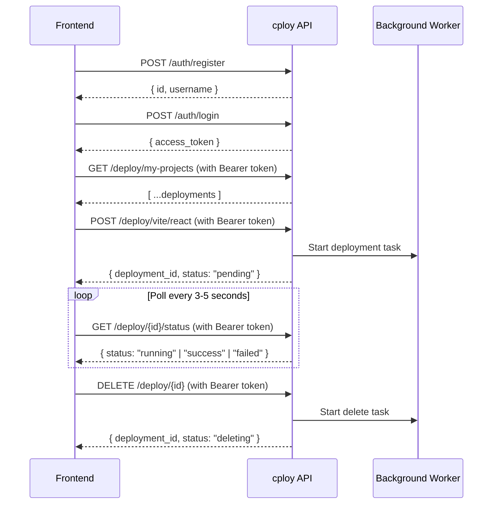
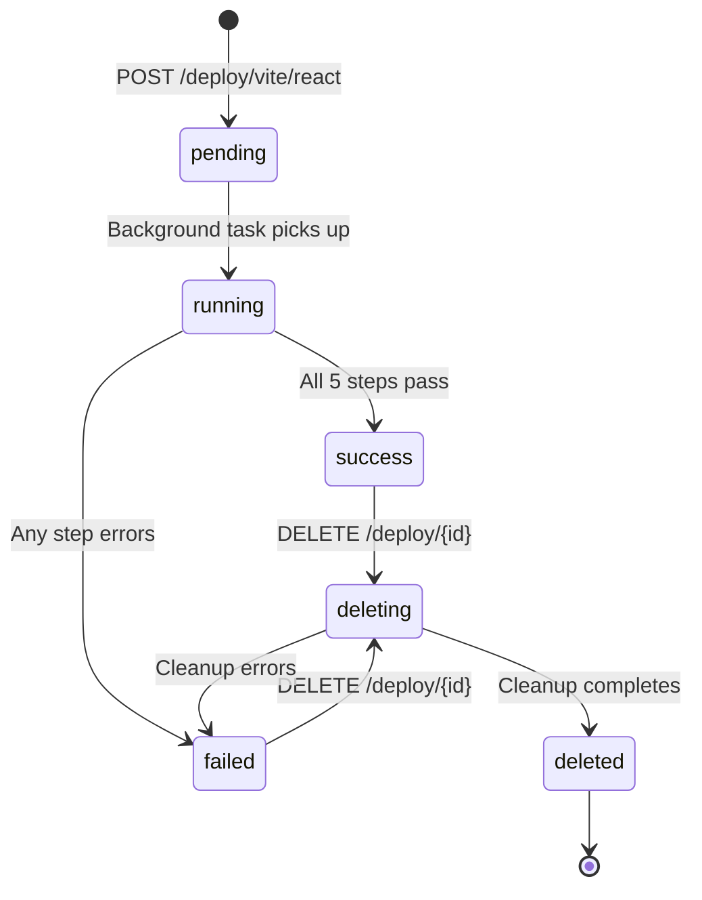

# cploy API Documentation

> **Base URL**: `http://<server-ip>:8000`
> **Interactive Docs**: `GET /docs` (Swagger UI) · `GET /redoc` (ReDoc)

---

## Table of Contents

- [Overview](#overview)
- [CORS Configuration](#cors-configuration)
- [Authentication](#authentication)
  - [How Auth Works](#how-auth-works)
  - [POST /auth/register](#post-authregister)
  - [POST /auth/login](#post-authlogin)
- [Deploy](#deploy)
  - [How Deploy Works](#how-deploy-works)
  - [Deployment Limit](#deployment-limit)
  - [GET /deploy/my-projects](#get-deploymy-projects)
  - [POST /deploy/vite/react](#post-deployvitereact)
  - [GET /deploy/{deployment_id}/status](#get-deploydeployment_idstatus)
  - [DELETE /deploy/{deployment_id}](#delete-deploydeployment_id)
- [Health Check](#health-check)
  - [GET /](#get-)
- [Data Models Reference](#data-models-reference)
- [Deployment Status Lifecycle](#deployment-status-lifecycle)
- [Error Reference](#error-reference)
- [Frontend Integration Guide](#frontend-integration-guide)

---

## Overview

cploy is a self-hosted deployment platform. The API lets you:

1. **Register** an account and **log in** to receive a JWT
2. **Deploy** a Vite + React app from a GitHub repo (runs asynchronously in the background)
3. **Poll** the deployment status until it completes
4. **List** all your deployed projects
5. **Delete** a deployment (tears down Docker container, nginx config, and files)

> [!IMPORTANT]
> Each user is limited to **2 active deployments** at a time. Deleting a deployment or having a failed one frees up a slot.

All deploy endpoints are **protected** — they require a valid JWT in the `Authorization` header.



---

## CORS Configuration

The API allows requests from these origins:

| Origin | Purpose |
|--------|---------|
| `http://localhost:5173` | Vite dev server |
| `https://dev-saurabh-k.xyz` | Production domain |
| `https://www.dev-saurabh-k.xyz` | www subdomain |
| `https://cploy.dev-saurabh-k.xyz` | cploy subdomain |

All methods, headers, and credentials are allowed. Requests from other origins will be blocked by the browser.

---

## Authentication

### How Auth Works

| Detail | Value |
|--------|-------|
| **Method** | JWT Bearer Token (OAuth2 Password Flow) |
| **Token Lifetime** | 60 minutes |
| **Algorithm** | HS256 |
| **Header Format** | `Authorization: Bearer <token>` |

> [!IMPORTANT]
> Store the `access_token` securely on the client (e.g. in memory or `httpOnly` cookie). Include it in the `Authorization` header for all protected endpoints.

---

### POST /auth/register

Create a new user account.

| Property | Value |
|----------|-------|
| **URL** | `/auth/register` |
| **Method** | `POST` |
| **Auth Required** | ❌ No |
| **Content-Type** | `application/json` |

#### Request Body

| Field | Type | Required | Description |
|-------|------|----------|-------------|
| `username` | `string` | ✅ | Unique username (max 50 characters) |
| `password` | `string` | ✅ | Plain-text password (hashed server-side with bcrypt) |

```json
{
  "username": "john",
  "password": "securePassword123"
}
```

#### Success Response — `201 Created`

| Field | Type | Description |
|-------|------|-------------|
| `id` | `integer` | The newly created user's ID |
| `username` | `string` | The registered username |

```json
{
  "id": 1,
  "username": "john"
}
```

#### Error Responses

| Status | Condition | Response Body |
|--------|-----------|---------------|
| `400 Bad Request` | Username already taken | `{"detail": "Username already taken"}` |
| `422 Unprocessable Entity` | Missing/invalid fields | Validation error details |

#### Frontend Example

```javascript
const response = await fetch("/auth/register", {
  method: "POST",
  headers: { "Content-Type": "application/json" },
  body: JSON.stringify({
    username: "john",
    password: "securePassword123",
  }),
});

if (response.status === 201) {
  const user = await response.json();
  console.log("Registered:", user.username);
} else if (response.status === 400) {
  const error = await response.json();
  alert(error.detail); // "Username already taken"
}
```

---

### POST /auth/login

Authenticate with username and password. Returns a JWT access token.

| Property | Value |
|----------|-------|
| **URL** | `/auth/login` |
| **Method** | `POST` |
| **Auth Required** | ❌ No |
| **Content-Type** | `application/x-www-form-urlencoded` |

> [!WARNING]
> This endpoint uses **form data** (`application/x-www-form-urlencoded`), **not** JSON. This follows the OAuth2 password flow standard.

#### Request Body (Form Fields)

| Field | Type | Required | Description |
|-------|------|----------|-------------|
| `username` | `string` | ✅ | Registered username |
| `password` | `string` | ✅ | User's password |

```
username=john&password=securePassword123
```

#### Success Response — `200 OK`

| Field | Type | Description |
|-------|------|-------------|
| `access_token` | `string` | JWT token to use in `Authorization` header |
| `token_type` | `string` | Always `"bearer"` |

```json
{
  "access_token": "eyJhbGciOiJIUzI1NiIsInR5cCI6IkpXVCJ9.eyJzdWIiOiJqb2huIiwiZXhwIjoxNjk...",
  "token_type": "bearer"
}
```

#### Error Responses

| Status | Condition | Response Body |
|--------|-----------|---------------|
| `401 Unauthorized` | Wrong username or password | `{"detail": "Invalid username or password"}` |
| `422 Unprocessable Entity` | Missing fields | Validation error details |

#### Frontend Example

```javascript
const response = await fetch("/auth/login", {
  method: "POST",
  headers: { "Content-Type": "application/x-www-form-urlencoded" },
  body: new URLSearchParams({
    username: "john",
    password: "securePassword123",
  }),
});

if (response.ok) {
  const data = await response.json();
  // Store token for subsequent requests
  localStorage.setItem("token", data.access_token);
} else {
  const error = await response.json();
  alert(error.detail); // "Invalid username or password"
}
```

---

## Deploy

### How Deploy Works

Deployments are **asynchronous**. When you start a deploy:

1. The API creates a deployment record and returns immediately with `202 Accepted`
2. The actual build + deploy runs in a background task on the server
3. The frontend **polls** the status endpoint to track progress

The deployment pipeline runs these steps sequentially:
1. Create deployment directory on the server
2. Generate `docker-compose.yml`
3. Write supplied environment variables to the deployment's `.env` file
4. Clone the GitHub repository
5. Run `docker compose up -d --build` (which loads `.env`)
6. Configure nginx reverse proxy

If any step fails, the deployment is marked `failed` with the error details.

> [!TIP]
> Multiple deployments can run concurrently. Each runs in its own background task, so users don't have to wait for each other.

### Automatic Port Assignment

Ports are **automatically assigned** by the server — you don't need to provide one. The server picks the next available port from the range **10000–40000** by checking the database for ports already in use by active deployments. Ports from `deleted` or `failed` deployments are recycled.

The assigned port is visible in the response when you poll `GET /deploy/{id}/status` or `GET /deploy/my-projects`.

### Deployment Limit

> [!IMPORTANT]
> Each user can have a maximum of **2 active deployments** at any time. Active means any deployment that is not in `deleted` or `failed` status (i.e. `pending`, `running`, `success`, or `deleting` all count).

If the limit is reached, `POST /deploy/vite/react` returns:

```json
// 403 Forbidden
{
  "detail": "Deployment limit reached. Maximum 2 active deployments per user."
}
```

**How to free up a slot:**
- Delete an existing deployment via `DELETE /deploy/{id}`
- A `failed` deployment does not count toward the limit

---

### GET /deploy/my-projects

List all deployments belonging to the authenticated user. Returns deployments sorted by newest first.

| Property | Value |
|----------|-------|
| **URL** | `/deploy/my-projects` |
| **Method** | `GET` |
| **Auth Required** | ✅ Yes — `Authorization: Bearer <token>` |

#### Request Headers

| Header | Value | Required |
|--------|-------|----------|
| `Authorization` | `Bearer <access_token>` | ✅ |

#### Success Response — `200 OK`

Returns an **array** of deployment objects. Empty array `[]` if the user has no deployments.

| Field | Type | Nullable | Description |
|-------|------|----------|-------------|
| `id` | `integer` | No | Deployment ID |
| `image_name` | `string` | No | Docker image/container name |
| `port` | `string` | No | Auto-assigned host port (10000–40000) |
| `repo_url` | `string` | No | GitHub repository URL |
| `status` | `string` | No | One of: `pending`, `running`, `success`, `failed`, `deleting`, `deleted` |
| `error_message` | `string` | Yes | Error details (only when `status` is `"failed"`) |
| `domain` | `string` | Yes | Live domain URL (only when `status` is `"success"`) |

```json
[
  {
    "id": 2,
    "image_name": "portfolio",
    "port": "10006",
    "repo_url": "https://github.com/john/portfolio.git",
    "status": "success",
    "error_message": null,
    "domain": "portfolio.dev-saurabh-k.xyz"
  },
  {
    "id": 1,
    "image_name": "myapp",
    "port": "10005",
    "repo_url": "https://github.com/john/myapp.git",
    "status": "failed",
    "error_message": "docker_compose: Error response from daemon: ...",
    "domain": null
  }
]
```

#### Error Responses

| Status | Condition | Response Body |
|--------|-----------|---------------|
| `401 Unauthorized` | Missing or invalid token | `{"detail": "Invalid or expired token"}` |

#### Frontend Example

```javascript
const token = localStorage.getItem("token");

const response = await fetch("/deploy/my-projects", {
  headers: { Authorization: `Bearer ${token}` },
});

if (response.ok) {
  const projects = await response.json();

  projects.forEach((project) => {
    console.log(`${project.image_name} — ${project.status}`);
    if (project.domain) {
      console.log(`  Live at: https://${project.domain}`);
    }
    if (project.error_message) {
      console.log(`  Error: ${project.error_message}`);
    }
  });
} else if (response.status === 401) {
  window.location.href = "/login";
}
```

---

### POST /deploy/vite/react

Start a new Vite + React deployment. The request returns immediately while the deployment runs in the background.

| Property | Value |
|----------|-------|
| **URL** | `/deploy/vite/react` |
| **Method** | `POST` |
| **Auth Required** | ✅ Yes — `Authorization: Bearer <token>` |
| **Content-Type** | `application/json` |

#### Request Headers

| Header | Value | Required |
|--------|-------|----------|
| `Authorization` | `Bearer <access_token>` | ✅ |
| `Content-Type` | `application/json` | ✅ |

#### Request Body

| Field | Type | Required | Description |
|-------|------|----------|-------------|
| `image_name` | `string` | ✅ | App name for the Docker container and subdomain: `<image_name>.dev-saurabh-k.xyz`. Must be 1–63 lowercase characters; start with a letter; and contain only lowercase letters, digits, or internal hyphens. |
| `repo_url` | `string` | ✅ | GitHub repository URL to clone (e.g. `"https://github.com/user/repo.git"`) |
| `environment_variables` | `object` | No | Environment variables to provide to the container. Keys must be valid shell-style variable names; values must be strings. Defaults to `{}`. |

```json
{
  "image_name": "myapp",
  "repo_url": "https://github.com/johndoe/my-react-app.git",
  "environment_variables": {
    "API_URL": "https://api.example.com",
    "FEATURE_FLAG": "enabled"
  }
}
```

The variables are written to `/opt/deployCode/<image_name>/.env`. The generated
Compose configuration uses that file as its `env_file`, so they are available to
the running container. They are not returned by deployment status endpoints.

> [!IMPORTANT]
> - `image_name` must be **unique across all active deployments** (including other users), because it becomes the Docker container name and nginx subdomain. Names are 1–63 characters, start with a lowercase letter, may include lowercase letters, digits, and internal hyphens, and cannot end with a hyphen.
> - `repo_url` must contain a valid Vite + React project with a `package.json` at the root
> - User must have **fewer than 2 active deployments** or the request will be rejected
> - **Port is auto-assigned** from range 10000–40000 — do not send it in the request
> - You may send up to **100** environment variables. Names must start with a letter or underscore and contain only letters, digits, and underscores. Values cannot contain line breaks.

#### Success Response — `202 Accepted`

| Field | Type | Description |
|-------|------|-------------|
| `deployment_id` | `integer` | Unique ID to poll for status |
| `status` | `string` | Always `"pending"` at this point |
| `message` | `string` | Human-readable instructions |

```json
{
  "deployment_id": 1,
  "status": "pending",
  "message": "Deployment started. Poll /deploy/{id}/status for updates."
}
```

#### Error Responses

| Status | Condition | Response Body |
|--------|-----------|---------------|
| `400 Bad Request` | Repository is private or not found | `{"detail": "Repository is private or does not exist. You must provide a public GitHub repository link."}` |
| `401 Unauthorized` | Missing or invalid token | `{"detail": "Invalid or expired token"}` |
| `401 Unauthorized` | No `Authorization` header | `{"detail": "Not authenticated"}` |
| `403 Forbidden` | User already has 2 active deployments | `{"detail": "Deployment limit reached. Maximum 2 active deployments per user."}` |
| `409 Conflict` | An active deployment already uses `image_name` | `{"detail": "An active deployment already uses this app name."}` |
| `422 Unprocessable Entity` | Missing/invalid fields | Validation error details |
| `503 Service Unavailable` | All ports in range are in use | `{"detail": "No available ports. Please try again later."}` |

#### Frontend Example

```javascript
const token = localStorage.getItem("token");

const response = await fetch("/deploy/vite/react", {
  method: "POST",
  headers: {
    "Content-Type": "application/json",
    Authorization: `Bearer ${token}`,
  },
  body: JSON.stringify({
    image_name: "myapp",
    repo_url: "https://github.com/johndoe/my-react-app.git",
    environment_variables: {
      API_URL: "https://api.example.com",
      FEATURE_FLAG: "enabled",
    },
  }),
});

if (response.status === 202) {
  const data = await response.json();
  // Start polling for status
  pollDeploymentStatus(data.deployment_id);
} else if (response.status === 403) {
  const error = await response.json();
  alert(error.detail); // "Deployment limit reached..."
} else if (response.status === 401) {
  window.location.href = "/login";
}
```

---

### GET /deploy/{deployment_id}/status

Check the current status of a deployment. Users can only view their own deployments.

| Property | Value |
|----------|-------|
| **URL** | `/deploy/{deployment_id}/status` |
| **Method** | `GET` |
| **Auth Required** | ✅ Yes — `Authorization: Bearer <token>` |

#### Path Parameters

| Parameter | Type | Required | Description |
|-----------|------|----------|-------------|
| `deployment_id` | `integer` | ✅ | The deployment ID returned from the deploy endpoint |

#### Request Headers

| Header | Value | Required |
|--------|-------|----------|
| `Authorization` | `Bearer <access_token>` | ✅ |

#### Success Response — `200 OK`

| Field | Type | Nullable | Description |
|-------|------|----------|-------------|
| `id` | `integer` | No | Deployment ID |
| `image_name` | `string` | No | Docker image/container name |
| `port` | `string` | No | Auto-assigned host port (10000–40000) |
| `repo_url` | `string` | No | GitHub repository URL |
| `status` | `string` | No | One of: `pending`, `running`, `success`, `failed`, `deleting`, `deleted` |
| `error_message` | `string` | Yes | Error details (only when `status` is `"failed"`) |
| `domain` | `string` | Yes | Live domain URL (only when `status` is `"success"`) |

**Example — Pending / Running:**
```json
{
  "id": 1,
  "image_name": "myapp",
  "port": "10005",
  "repo_url": "https://github.com/johndoe/my-react-app.git",
  "status": "running",
  "error_message": null,
  "domain": null
}
```

**Example — Success:**
```json
{
  "id": 1,
  "image_name": "myapp",
  "port": "10005",
  "repo_url": "https://github.com/johndoe/my-react-app.git",
  "status": "success",
  "error_message": null,
  "domain": "myapp.dev-saurabh-k.xyz"
}
```

**Example — Failed:**
```json
{
  "id": 1,
  "image_name": "myapp",
  "port": "10005",
  "repo_url": "https://github.com/johndoe/my-react-app.git",
  "status": "failed",
  "error_message": "docker_compose: Error response from daemon: ...",
  "domain": null
}
```

**Example — Deleted:**
```json
{
  "id": 1,
  "image_name": "myapp",
  "port": "10005",
  "repo_url": "https://github.com/johndoe/my-react-app.git",
  "status": "deleted",
  "error_message": null,
  "domain": null
}
```

#### Error Responses

| Status | Condition | Response Body |
|--------|-----------|---------------|
| `401 Unauthorized` | Missing or invalid token | `{"detail": "Invalid or expired token"}` |
| `404 Not Found` | Deployment doesn't exist or belongs to another user | `{"detail": "Deployment not found"}` |

#### Frontend Example — Polling

```javascript
async function pollDeploymentStatus(deploymentId) {
  const token = localStorage.getItem("token");

  const poll = setInterval(async () => {
    const response = await fetch(`/deploy/${deploymentId}/status`, {
      headers: { Authorization: `Bearer ${token}` },
    });

    if (response.status === 401) {
      clearInterval(poll);
      window.location.href = "/login";
      return;
    }

    const data = await response.json();

    switch (data.status) {
      case "pending":
        console.log("⏳ Waiting to start...");
        break;
      case "running":
        console.log("🚀 Deployment in progress...");
        break;
      case "success":
        clearInterval(poll);
        console.log(`✅ Live at: https://${data.domain}`);
        break;
      case "failed":
        clearInterval(poll);
        console.error(`❌ Failed: ${data.error_message}`);
        break;
      case "deleting":
        console.log("🗑️ Deleting...");
        break;
      case "deleted":
        clearInterval(poll);
        console.log("🗑️ Deployment deleted");
        break;
    }
  }, 3000); // Poll every 3 seconds
}
```

---

### DELETE /deploy/{deployment_id}

Delete a deployment. Tears down the Docker container and images, removes nginx config, and deletes all files from the server. Runs asynchronously as a background task.

| Property | Value |
|----------|-------|
| **URL** | `/deploy/{deployment_id}` |
| **Method** | `DELETE` |
| **Auth Required** | ✅ Yes — `Authorization: Bearer <token>` |

#### Path Parameters

| Parameter | Type | Required | Description |
|-----------|------|----------|-------------|
| `deployment_id` | `integer` | ✅ | The deployment ID to delete |

#### Request Headers

| Header | Value | Required |
|--------|-------|----------|
| `Authorization` | `Bearer <access_token>` | ✅ |

#### What Gets Deleted

The `delete_deployment.sh` script runs these cleanup steps:
1. Remove nginx symlink from `sites-enabled`
2. Remove nginx config from `sites-available`
3. Test and reload nginx
4. Run `docker compose down --rmi all --remove-orphans` (stops containers, removes images)
5. Delete the entire deployment directory (`/opt/deployCode/<image_name>`)

#### Success Response — `200 OK`

| Field | Type | Description |
|-------|------|-------------|
| `deployment_id` | `integer` | The deployment being deleted |
| `status` | `string` | `"deleting"` — deletion is in progress |
| `message` | `string` | Human-readable instructions |

```json
{
  "deployment_id": 1,
  "status": "deleting",
  "message": "Deletion started. Poll /deploy/{id}/status for updates."
}
```

#### Error Responses

| Status | Condition | Response Body |
|--------|-----------|---------------|
| `401 Unauthorized` | Missing or invalid token | `{"detail": "Invalid or expired token"}` |
| `404 Not Found` | Deployment doesn't exist or belongs to another user | `{"detail": "Deployment not found"}` |
| `409 Conflict` | Deployment is already being deleted | `{"detail": "Deployment is already being deleted"}` |
| `410 Gone` | Deployment has already been deleted | `{"detail": "Deployment has already been deleted"}` |

#### Frontend Example

```javascript
async function deleteDeployment(deploymentId) {
  const token = localStorage.getItem("token");

  const response = await fetch(`/deploy/${deploymentId}`, {
    method: "DELETE",
    headers: { Authorization: `Bearer ${token}` },
  });

  if (response.ok) {
    const data = await response.json();
    console.log(data.message);
    // Poll for deletion completion
    pollDeploymentStatus(deploymentId);
  } else {
    const error = await response.json();
    switch (response.status) {
      case 401:
        window.location.href = "/login";
        break;
      case 404:
        alert("Deployment not found");
        break;
      case 409:
        alert("Already being deleted — please wait");
        break;
      case 410:
        alert("This deployment was already deleted");
        break;
    }
  }
}
```

---

## Health Check

### GET /

Simple health check endpoint. No authentication required.

| Property | Value |
|----------|-------|
| **URL** | `/` |
| **Method** | `GET` |
| **Auth Required** | ❌ No |

#### Response — `200 OK`

```json
{
  "status": "working"
}
```

---

## Data Models Reference

### User

| Field | Type | Description |
|-------|------|-------------|
| `id` | `integer` | Auto-incrementing primary key |
| `username` | `string(50)` | Unique username |
| `hashed_password` | `string(255)` | Bcrypt-hashed password (never exposed via API) |
| `created_at` | `datetime` | UTC timestamp of account creation |

### Deployment

| Field | Type | Description |
|-------|------|-------------|
| `id` | `integer` | Auto-incrementing primary key |
| `user_id` | `integer` | Foreign key → `users.id` |
| `image_name` | `string(100)` | Docker image/container name |
| `port` | `string(10)` | Auto-assigned host port (range 10000–40000) |
| `repo_url` | `string(500)` | GitHub repository URL |
| `status` | `string(20)` | `pending` \| `running` \| `success` \| `failed` \| `deleting` \| `deleted` |
| `error_message` | `text` | Error details (null if no error) |
| `domain` | `string(200)` | Generated domain (null until success) |
| `created_at` | `datetime` | UTC timestamp of deployment creation |
| `updated_at` | `datetime` | UTC timestamp of last status change |

---

## Deployment Status Lifecycle



| Status | Meaning | `error_message` | `domain` | Counts toward limit? |
|--------|---------|------------------|----------|----------------------|
| `pending` | Created, waiting for background task to start | `null` | `null` | ✅ Yes |
| `running` | Background task is executing the pipeline | `null` | `null` | ✅ Yes |
| `success` | All steps completed — app is live | `null` | `"<image_name>.dev-saurabh-k.xyz"` | ✅ Yes |
| `failed` | A step in the pipeline errored out | Contains error details | `null` | ❌ No |
| `deleting` | Delete script is running | `null` | `null` | ✅ Yes |
| `deleted` | Fully cleaned up | `null` | `null` | ❌ No |

---

## Error Reference

All error responses use this format:

```json
{
  "detail": "Human-readable error message"
}
```

### HTTP Status Codes

| Code | Meaning | When |
|------|---------|------|
| `200 OK` | Request succeeded | Login, status check, list projects, delete |
| `201 Created` | Resource created | Registration |
| `202 Accepted` | Accepted for background processing | Deploy started |
| `400 Bad Request` | Client error | Duplicate username |
| `401 Unauthorized` | Authentication failed | Missing/invalid/expired token, wrong credentials |
| `403 Forbidden` | Limit exceeded | User has 2 active deployments |
| `404 Not Found` | Resource not found | Deployment ID doesn't exist or belongs to another user |
| `409 Conflict` | Conflicting active app name or action already in progress | An active deployment already uses the app name, or the deployment is already being deleted |
| `410 Gone` | Resource already removed | Deployment was already deleted |
| `422 Unprocessable Entity` | Validation failed | Missing required fields, wrong data types |
| `503 Service Unavailable` | No ports available | All ports in range 10000–40000 are in use |

### 422 Validation Error Format

When request validation fails, the response body includes detailed field-level errors:

```json
{
  "detail": [
    {
      "loc": ["body", "image_name"],
      "msg": "Field required",
      "type": "missing"
    }
  ]
}
```

---

## Frontend Integration Guide

### Complete Auth Module

```javascript
// ─── auth.js ─────────────────────────────────────────────

const API_BASE = "http://<server-ip>:8000";

export async function register(username, password) {
  const res = await fetch(`${API_BASE}/auth/register`, {
    method: "POST",
    headers: { "Content-Type": "application/json" },
    body: JSON.stringify({ username, password }),
  });
  if (!res.ok) throw await res.json();
  return res.json();
}

export async function login(username, password) {
  const res = await fetch(`${API_BASE}/auth/login`, {
    method: "POST",
    headers: { "Content-Type": "application/x-www-form-urlencoded" },
    body: new URLSearchParams({ username, password }),
  });
  if (!res.ok) throw await res.json();
  const data = await res.json();
  localStorage.setItem("token", data.access_token);
  return data;
}

export function getToken() {
  return localStorage.getItem("token");
}

export function logout() {
  localStorage.removeItem("token");
}

export function authHeaders() {
  return { Authorization: `Bearer ${getToken()}` };
}
```

### Complete Deploy Module

```javascript
// ─── deploy.js ───────────────────────────────────────────

import { authHeaders } from "./auth.js";

const API_BASE = "http://<server-ip>:8000";

/** List all projects for the current user */
export async function getMyProjects() {
  const res = await fetch(`${API_BASE}/deploy/my-projects`, {
    headers: authHeaders(),
  });
  if (!res.ok) throw await res.json();
  return res.json(); // DeployStatusResponse[]
}

/** Start a new deployment (port is auto-assigned by the server) */
export async function startDeploy(imageName, repoUrl, environmentVariables = {}) {
  const res = await fetch(`${API_BASE}/deploy/vite/react`, {
    method: "POST",
    headers: {
      "Content-Type": "application/json",
      ...authHeaders(),
    },
    body: JSON.stringify({
      image_name: imageName,
      repo_url: repoUrl,
      environment_variables: environmentVariables,
    }),
  });
  if (!res.ok) throw await res.json();
  return res.json(); // { deployment_id, status, message }
}

/** Get status of a single deployment */
export async function getDeployStatus(deploymentId) {
  const res = await fetch(`${API_BASE}/deploy/${deploymentId}/status`, {
    headers: authHeaders(),
  });
  if (!res.ok) throw await res.json();
  return res.json();
}

/** Delete a deployment */
export async function deleteDeployment(deploymentId) {
  const res = await fetch(`${API_BASE}/deploy/${deploymentId}`, {
    method: "DELETE",
    headers: authHeaders(),
  });
  if (!res.ok) throw await res.json();
  return res.json(); // { deployment_id, status, message }
}

/**
 * Poll deployment status until it reaches a terminal state.
 * @param {number} deploymentId
 * @param {function} onUpdate - Called with status object on each poll
 * @param {number} intervalMs - Poll interval (default 3000ms)
 * @returns {Promise} Resolves with final status object
 */
export function watchDeploy(deploymentId, onUpdate, intervalMs = 3000) {
  const terminalStatuses = ["success", "failed", "deleted"];

  return new Promise((resolve, reject) => {
    const poll = setInterval(async () => {
      try {
        const status = await getDeployStatus(deploymentId);
        onUpdate(status);

        if (terminalStatuses.includes(status.status)) {
          clearInterval(poll);
          resolve(status);
        }
      } catch (err) {
        clearInterval(poll);
        reject(err);
      }
    }, intervalMs);
  });
}
```

### Full Usage Example (React)

```jsx
import { login } from "./auth";
import { getMyProjects, startDeploy, deleteDeployment, watchDeploy } from "./deploy";

// ── List all projects ──
async function showProjects() {
  const projects = await getMyProjects();
  console.log(`You have ${projects.length} deployment(s)`);
  projects.forEach((p) => {
    console.log(`  ${p.image_name} — ${p.status} (port: ${p.port}) ${p.domain ? `→ ${p.domain}` : ""}`);
  });
}

// ── Deploy a new app (port is auto-assigned) ──
async function handleDeploy() {
  await login("john", "securePassword123");

  try {
    const { deployment_id } = await startDeploy(
      "my-portfolio",
      "https://github.com/john/portfolio.git",
      { API_URL: "https://api.example.com" }
    );

    const result = await watchDeploy(deployment_id, (status) => {
      console.log(`Status: ${status.status}`);
      // Update your UI progress indicator here
    });

    if (result.status === "success") {
      alert(`🎉 Live at https://${result.domain}`);
    } else {
      alert(`❌ Error: ${result.error_message}`);
    }
  } catch (err) {
    if (err.detail?.includes("Deployment limit")) {
      alert("You already have 2 active deployments. Delete one first.");
    }
  }
}

// ── Delete a deployment ──
async function handleDelete(deploymentId) {
  try {
    await deleteDeployment(deploymentId);
    const result = await watchDeploy(deploymentId, (status) => {
      console.log(`Deleting: ${status.status}`);
    });
    console.log("Deployment deleted successfully");
  } catch (err) {
    alert(err.detail);
  }
}
```

---

## Quick Reference — All Endpoints

| Method | Path | Auth | Description |
|--------|------|------|-------------|
| `GET` | `/` | ❌ | Health check |
| `POST` | `/auth/register` | ❌ | Create account |
| `POST` | `/auth/login` | ❌ | Login → JWT token |
| `GET` | `/deploy/my-projects` | ✅ | List user's deployments |
| `POST` | `/deploy/vite/react` | ✅ | Start deployment (max 2) |
| `GET` | `/deploy/{id}/status` | ✅ | Poll deployment status |
| `DELETE` | `/deploy/{id}` | ✅ | Delete deployment |
